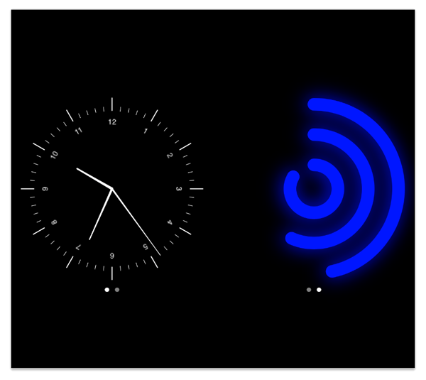

# WatchFace v1.0

WatchFace subclasses UIView, and adds faces to a UIScrollView, it can have many faces. 

  - Reusable code
  - Easy to add new faces
  - Fading paging 

### Image

### Gestures
WatchFace has the following gestures
* Swipe left and right, to view faces

### Requirments
* iOS 10.2
* Swift 3

### Installation

* download the zip file.
* unzip
* open WatchFace.xcodeproj

### Change Log
* v1.0 first commit
